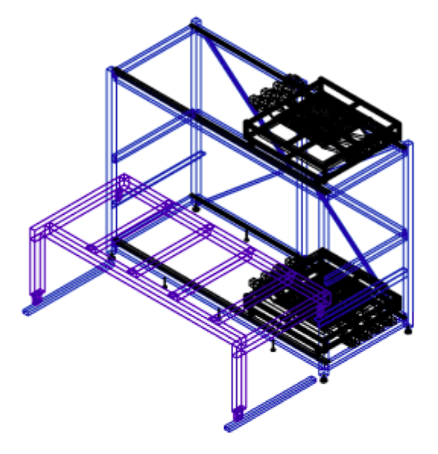

# ATLAS Naples Tower Software Documentation

This book contains the entire documentation for **Naples ALTAS Tower Software**

This project is under construction and they are the efforts to produce a complete set of software tools to analyze the data comming from the Tower Test Station in the Physics Department of in Naples University "Federico II":

### Software Repositories

This is an open source project under CERN IT infrastructure, the source code of the tool is available on [GitLab](https://gitlab.cern.ch/arturos/ATLAS-NA-Tower).

The group of developers has been defined in GitLab as well, under the project [GitLab CERN group](https://gitlab.cern.ch/groups/Naples-Software-ATLAS)

### Other documentations

Documentation for developers is accessible at [developer.gitbook.com](https://developer.gitbook.com).

Setup guide and documentation for the enterprise version is accessible at [twiki: Test Station Naples Project ATLAS](https://twiki.cern.ch/twiki/bin/view/Main/TestStationNaplesProjectATLAS).

### Help and Support

We're happy to help out with the software or the documentation. You can ask a question or signal an issue on the following contact form at [gitbook.com/contact](https://www.gitbook.com/contact).

For CERN users, the Naples Jira project is a good place to post issues and features of the code: [Jira Project](https://its.cern.ch/jira/browse/ATLASNA).

### Contribute to this documentation

You can contribute to improve this documentation on [GitHub](https://github.com/artfisica/documentation) by signaling issues or proposing changes.
