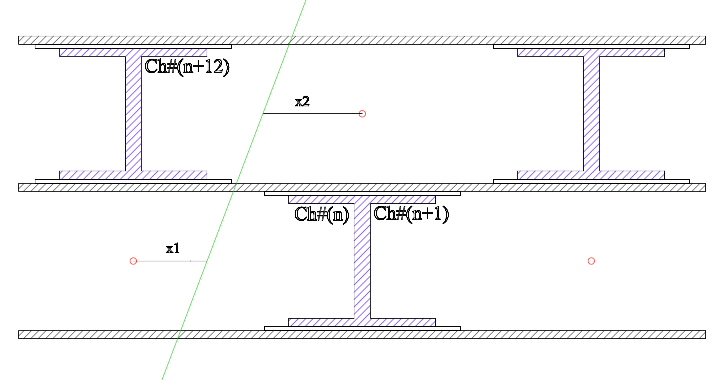

# Introduction to the Fitting Block



https://www.youtube.com/watch?v=aIMgfBZrrZ80


```js
define(<span class="hljs-function">
<span class="hljs-keyword">function</span>(<span class="hljs-params"></span>)</span>{

    <span class="hljs-keyword">var</span> execute_selection= <span class="hljs-function"><span class="hljs-keyword">function</span> (<span class="hljs-params">cell, stop_on_error</span>) </span>{
        <span class="hljs-comment">// adapted from Cell.prototype.execute, (copy and past + except take cell a on first input) </span>
        <span class="hljs-comment">// then s/this/cell/</span>
        <span class="hljs-comment">// s/get_text/code_mirror.getSelection/</span>
        <span class="hljs-keyword">if</span> (!cell.kernel || !cell.kernel.is_connected()) {
            <span class="hljs-built_in">console</span>.log(<span class="hljs-string">"Can't execute, kernel is not connected."</span>);
            <span class="hljs-keyword">return</span>;
        }

        cell.output_area.clear_output(<span class="hljs-literal">false</span>, <span class="hljs-literal">true</span>);

        <span class="hljs-keyword">if</span> (stop_on_error === <span class="hljs-literal">undefined</span>) {
            stop_on_error = <span class="hljs-literal">true</span>;
        }

        <span class="hljs-keyword">var</span> old_msg_id = cell.last_msg_id;

        <span class="hljs-keyword">if</span> (old_msg_id) {
            cell.kernel.clear_callbacks_for_msg(old_msg_id);
            <span class="hljs-keyword">if</span> (old_msg_id) {
                <span class="hljs-comment">// figure out how to uncomment this one.</span>
                <span class="hljs-comment">//delete CodeCell.msg_cells[old_msg_id];</span>
            }
        }
        <span class="hljs-keyword">if</span> (cell.code_mirror.getSelection().trim().length === <span class="hljs-number">0</span>) {
            <span class="hljs-comment">// nothing to do</span>
            cell.set_input_prompt(<span class="hljs-literal">null</span>);
            <span class="hljs-keyword">return</span>;
        }
        cell.set_input_prompt(<span class="hljs-string">'*'</span>);
        cell.element.addClass(<span class="hljs-string">"running"</span>);
        <span class="hljs-keyword">var</span> callbacks = cell.get_callbacks();

        cell.last_msg_id = cell.kernel.execute(cell.code_mirror.getSelection(), callbacks, {silent: <span class="hljs-literal">false</span>, store_history: <span class="hljs-literal">true</span>,
            stop_on_error : stop_on_error});
        <span class="hljs-comment">// figure out how to uncomment this one.</span>
        <span class="hljs-comment">//CodeCell.msg_cells[cell.last_msg_id] = cell;</span>
        cell.render();
        cell.events.trigger(<span class="hljs-string">'execute.CodeCell'</span>, {cell: cell});
    };

    <span class="hljs-keyword">var</span> run_cell_selection  = {
        help: <span class="hljs-string">'run the current seleciton of the curent focused cell'</span>,
        icon : <span class="hljs-string">'fa-recycle'</span>,
        help_index : <span class="hljs-string">''</span>,
        handler : <span class="hljs-function"><span class="hljs-keyword">function</span> (<span class="hljs-params">env</span>) </span>{
            <span class="hljs-built_in">console</span>.info(<span class="hljs-string">"executing selection"</span>)
            <span class="hljs-keyword">var</span> cell = env.notebook.get_selected_cell();
            execute_selection(cell)
        }
  }

  <span class="hljs-keyword">return</span> {
    <span class="hljs-comment">// this will be called at extension loading time</span>
    <span class="hljs-comment">//---</span>
    load_ipython_extension: <span class="hljs-function"><span class="hljs-keyword">function</span>(<span class="hljs-params"></span>)</span>{
        <span class="hljs-keyword">var</span> action_name = IPython.keyboard_manager.actions.register(run_cell_selection, <span class="hljs-string">'run-current-cell-selection'</span>, <span class="hljs-string">'issue-252'</span>)

        <span class="hljs-comment">// bind to keyboard shortcut.</span>
        IPython.keyboard_manager.edit_shortcuts.add_shortcut(<span class="hljs-string">'Ctrl-Alt-Cmd-Enter'</span>, action_name)

    },
    <span class="hljs-comment">//---</span>
  };
})
```
